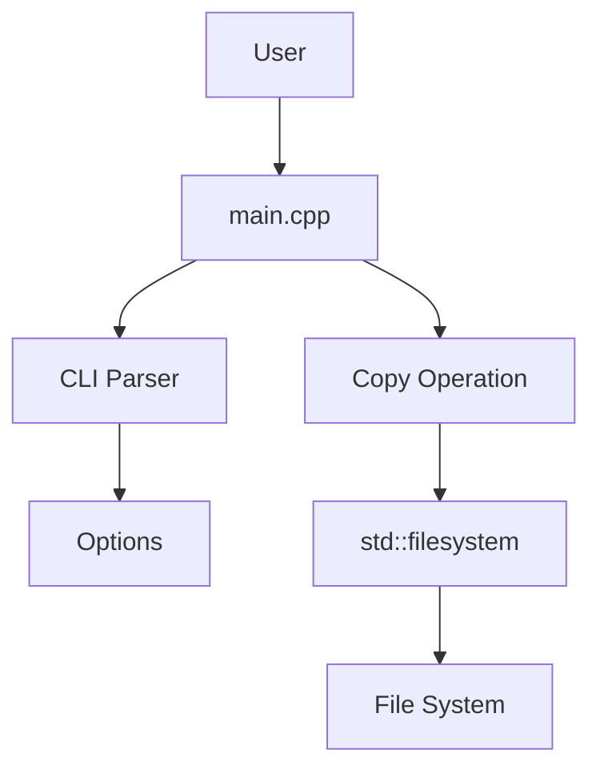
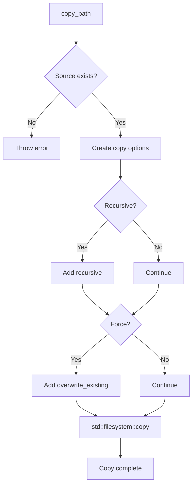
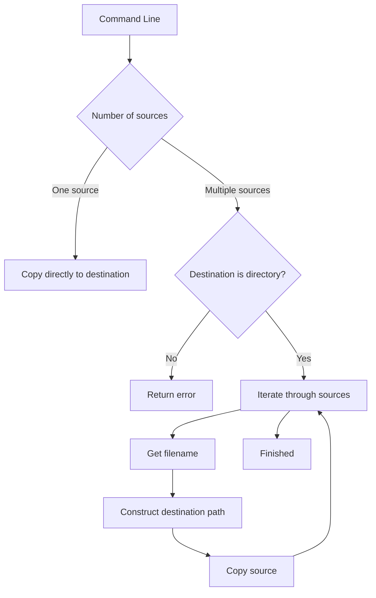
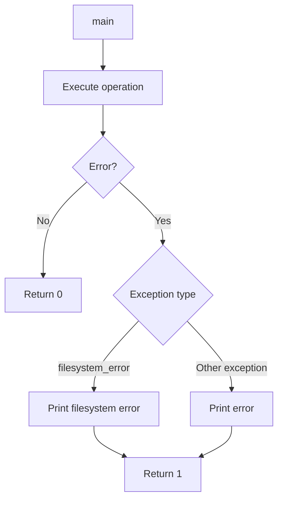
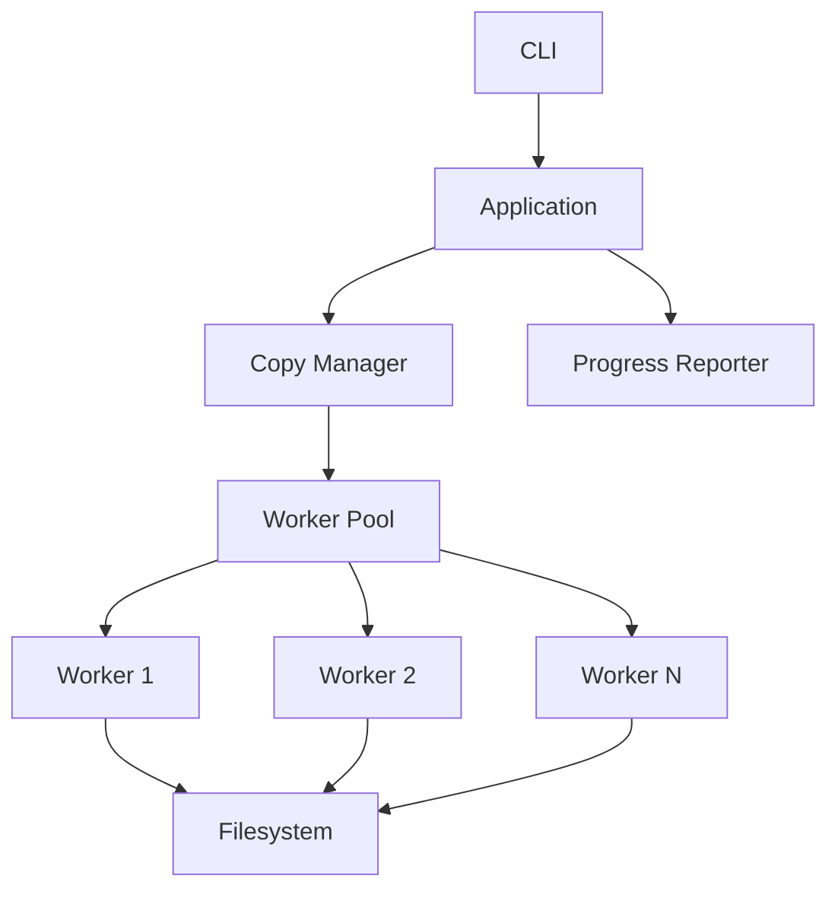

````markdown
# Zyn

A lightweight command-line file copying utility written in modern **C++20**.

Zyn provides a simple interface for copying files and directories with support for recursive copying and forced overwriting.

## Features

- File copying
- Directory copying
- Recursive copying with `-r`
- Force overwrite with `-f`
- Command-line help with `-h`
- Multiple source files
- Cross-platform path handling using `std::filesystem`
- C++20
- CMake-based build system
- Modular project structure
- Exception-based error handling

---

## Usage

```text
zyn [options] <source> [source ...] <destination>
````

### Options

| Option | Description                    |
| ------ | ------------------------------ |
| `-r`   | Recursively copy directories   |
| `-f`   | Force overwrite existing files |
| `-h`   | Display help                   |

### Examples

Copy a file:

```bash
zyn source.txt destination.txt
```

Force overwrite:

```bash
zyn -f source.txt destination.txt
```

Copy a directory recursively:

```bash
zyn -r source destination
```

Copy multiple files:

```bash
zyn file1.txt file2.txt destination/
```

Combine options:

```bash
zyn -rf source destination
```

---

## Architecture

Zyn is split into separate components for command-line parsing and filesystem operations.



### Components

#### `main.cpp`

Responsible for:

* Program entry point
* Coordinating the application
* Processing parsed options
* Validating source and destination arguments
* Handling single and multiple source files
* Top-level error handling

#### `cli.cpp`

Responsible for:

* Parsing command-line arguments
* Processing `-r`
* Processing `-f`
* Processing `-h`
* Supporting combined options such as `-rf`

#### `copier.cpp`

Responsible for:

* Validating source paths
* Constructing filesystem copy options
* Copying files
* Recursively copying directories
* Handling overwrite behavior

---

## Project Structure

```text
zyn/
├── CMakeLists.txt
├── .gitignore
│
├── include/
│   └── zyn/
│       ├── cli.hpp
│       └── copier.hpp
│
└── src/
    ├── cli.cpp
    ├── copier.cpp
    └── main.cpp
```

---

## C++20 Design

Zyn is implemented using modern C++ rather than directly translating the original C implementation.

### `std::filesystem`

Filesystem paths are represented using:

```cpp
std::filesystem::path
```

Instead of manually manipulating C strings:

```cpp
char dest_path[1024];

snprintf(
    dest_path,
    sizeof(dest_path),
    "%s/%s",
    destination,
    filename
);
```

Zyn uses:

```cpp
const auto destination_path =
    destination / source.filename();
```

This provides:

* Type-safe path handling
* Platform-independent path separators
* No fixed-size buffers
* Cleaner filesystem operations

---

## Copying

The core copy operation uses:

```cpp
std::filesystem::copy()
```

Copy options are constructed according to the command-line arguments.



For example:

```cpp
fs::copy_options options =
    fs::copy_options::none;

if (recursive) {
    options |= fs::copy_options::recursive;
}

if (force) {
    options |= fs::copy_options::overwrite_existing;
}
```

---

## Multiple Sources

When multiple sources are provided, the destination must be a directory.

For:

```bash
zyn file1.txt file2.txt destination/
```

Zyn constructs the destination paths using:

```cpp
destination / source.filename()
```

The resulting structure is:

```text
destination/
├── file1.txt
└── file2.txt
```

The flow is:



---

## Error Handling

Zyn uses C++ exceptions for error handling.



Filesystem errors are handled using:

```cpp
catch (const std::filesystem::filesystem_error& e)
```

while other application errors are handled using:

```cpp
catch (const std::exception& e)
```

---

## Building

### Requirements

* C++20 compatible compiler
* CMake 3.20+

For Debian/Ubuntu:

```bash
sudo apt update
sudo apt install g++ cmake
```

Check the compiler:

```bash
g++ --version
```

Check CMake:

```bash
cmake --version
```

### Configure

From the project root:

```bash
cmake -S . -B build
```

### Build

```bash
cmake --build build
```

The executable will be generated at:

```text
build/zyn
```

Run:

```bash
./build/zyn -h
```

---

## Installing

Zyn can be installed as a normal command-line utility.

Add the following to `CMakeLists.txt`:

```cmake
install(TARGETS zyn
    RUNTIME DESTINATION bin
)
```

Then:

```bash
cmake -S . -B build
cmake --build build
sudo cmake --install build
```

After installation:

```bash
zyn -h
```

can be used from any directory.

---

## Design Decisions

### Why `std::filesystem`?

The original implementation relied heavily on C-style string manipulation.

Zyn uses:

```cpp
std::filesystem::path
```

to handle paths instead.

This eliminates the need for:

* `strrchr`
* `snprintf`
* Fixed-size character buffers
* Manual path separator handling

### Why no threads?

Zyn currently performs copy operations sequentially.


Threads, mutexes, and atomics are intentionally not used at this stage.

Parallel copying could be added later after benchmarking whether it provides a meaningful performance improvement.

---

## Future Improvements

Potential future additions include:

* Parallel file copying
* Thread pool
* Progress reporting
* Verbose mode
* Dry-run mode
* Symbolic link handling
* File metadata preservation
* Better command-line parsing
* Unit tests
* Continuous integration
* Docker support

A possible future architecture could look like:



---

## Development

Configure and build:

```bash
cmake -S . -B build
cmake --build build
```

Run:

```bash
./build/zyn -h
```

Example:

```bash
./build/zyn -r source destination
```
